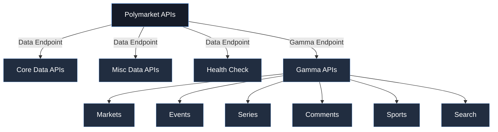

Welcome to **polymarket-data**, the community-maintained TypeScript SDK for Polymarket’s public
APIs.

> This SDK is built by independent contributors and is **not officially affiliated with the
> Polymarket team**. Always validate behaviour against Polymarket’s public documentation before
> deploying production systems.

<Columns cols={2}>
  <Card title="Quickstart" icon="rocket" href="/quickstart">
    Install the SDK, configure endpoints, and run your first health check.
  </Card>
</Columns>

---

## What’s in the box?

<Columns cols={2}>
  <Card title="Strong Typing" icon="shield-check">
    Every request/response is validated with Zod for runtime and IDE safety.
  </Card>
  <Card title="Live Examples" icon="code">
    Examples are exercised against the live Polymarket APIs for accuracy.
  </Card>
</Columns>

---

## Conceptual Diagram

The `Polymarket` constructor spins up **two** HTTP clients, one targeting the data endpoint and one
for the gamma endpoint. Each method inherits common validation and error handling layers.

---

## Ready to build?

<Columns cols={2}>
  <Card title="Data API" icon="database" href="/data/index">
    Positions, trades, activity, holders, and value analytics.
  </Card>
  <Card title="Gamma API" icon="radar" href="/gamma/index">
    Search, comments, series, markets, and events intelligence.
  </Card>
</Columns>

Happy building—and thanks for contributing to the broader Polymarket ecosystem.
